# Informações do Projeto

`TÍTULO DO PROJETO`  
Recomendation - recomendação de filmes e séries

`CURSO`
Engenharia de Software

## Participantes
>
> Os membros do grupo são:
>
> - Amanda Bueno Campos Peixoto
> - Gustavo Rodrigo Campos Rodrigues
> - Lucas Cerqueira Azevedo
> - Pedro Pope Braga
> - Rafael Cerqueira Azevedo

# Estrutura do Documento

- [Informações do Projeto](#informações-do-projeto)
  - [Participantes](#participantes)
- [Estrutura do Documento](#estrutura-do-documento)
- [Introdução](#introdução)
  - [Problema](#problema)
    - [Descrição do Problema](#descrição-do-problema)
    - [Matriz CSD](#matriz-csd)
  - [Objetivos](#objetivos)
  - [Justificativa](#justificativa)
  - [Público-Alvo](#público-alvo)
- [Especificações do Projeto](#especificações-do-projeto)
    - [Técnicas de Levantamento de Requisitos](#técnicas-de-levantamento-de-requisitos)
    - [Prototipação](#prototipação)
    - [Modelagem de Dados](#modelagem-de-dados)
    - [Tecnologias de Desenvolvimento](#tecnologias-de-desenvolvimento)
    - [Documentação do Projeto](#documentação-do-projeto)
  - [Personas e Mapas de Empatia](#personas-e-mapas-de-empatia)
    - [Maria - Persona 1: Cinéfila](#maria---persona-1-cinéfila)
    - [João - Persona 2: Profissional Ocupado](#joão---persona-2-profissional-ocupado)
    - [Enzo - Persona 3: Iniciante no Entretenimento](#enzo---persona-3-iniciante-no-entretenimento)
  - [Histórias de Usuários](#histórias-de-usuários)
  - [Requisitos](#requisitos)
    - [Requisitos Funcionais](#requisitos-funcionais)
    - [Requisitos não Funcionais](#requisitos-não-funcionais)
  - [Restrições](#restrições)
- [Projeto de Interface](#projeto-de-interface)
  - [User Flow - Protótipo Interativo](#user-flow---protótipo-interativo)
  - [Wireframes](#wireframes)
- [Metodologia](#metodologia)
    - [Metodologia Adotada](#metodologia-adotada)
      - [1. **Design Thinking:**](#1-design-thinking)
      - [2. **Framework Scrum:**](#2-framework-scrum)
      - [3. **Divisão de Papéis e Tarefas:**](#3-divisão-de-papéis-e-tarefas)
      - [4. **Ferramentas Empregadas:**](#4-ferramentas-empregadas)
  - [Divisão de Papéis](#divisão-de-papéis)
  - [Ferramentas](#ferramentas)
  - [Controle de Versão](#controle-de-versão)
- [Projeto da Solução](#projeto-da-solução)
  - [Tecnologias Utilizadas](#tecnologias-utilizadas)
  - [Arquitetura da solução](#arquitetura-da-solução)
- [Avaliação da Aplicação](#avaliação-da-aplicação)
  - [Relatório de Testes](#relatório-de-testes)
      - [1. Página de Inicial:](#1-página-de-inicial)
      - [2. Página de Login:](#2-página-de-login)
      - [3. Página de Cadastro:](#3-página-de-cadastro)
      - [4. Página de Cadastro de Gostos:](#4-página-de-cadastro-de-gostos)
      - [5. Página 4 - Adicionar Filmes ao Histórico:](#5-página-4---adicionar-filmes-ao-histórico)
      - [6. Home:](#6-home)
      - [7. Página de Perfil:](#7-página-de-perfil)
      - [8. Cards na Home:](#8-cards-na-home)
  - [Registros de Testes](#registros-de-testes)
  - [Resultados do Teste](#resultados-do-teste)
    - [Pontos Fortes:](#pontos-fortes)
    - [Pontos Fracos Identificados:](#pontos-fracos-identificados)
    - [Melhorias Planejadas:](#melhorias-planejadas)
- [Referências](#referências)
      - [Design Thinking:](#design-thinking)
      - [Scrum e Metodologias Ágeis:](#scrum-e-metodologias-ágeis)
      - [Testes de Software:](#testes-de-software)
      - [Arquitetura de Software:](#arquitetura-de-software)
      - [UX/UI Design:](#uxui-design)
      - [GitHub e Controle de Versão:](#github-e-controle-de-versão)
      - [Ferramentas de Desenvolvimento Web (HTML, CSS, JavaScript):](#ferramentas-de-desenvolvimento-web-html-css-javascript)

# Introdução

## Problema

### Descrição do Problema

Desafio de encontrar filmes e séries que correspondessem aos seus gostos pessoais em meio a uma vasta seleção de opções disponíveis nas plataformas de streaming. A falta de personalização e orientação resultava em diversas questões, incluindo:

1. **Desperdício de tempo:** Os usuários frequentemente perdiam tempo navegando por extensos catálogos de filmes e séries, muitos dos quais não eram relevantes para seus interesses.

2. **Frustração com recomendações genéricas:** As recomendações automáticas oferecidas pelas plataformas de streaming muitas vezes não refletiam as preferências individuais dos usuários, resultando em conteúdo não atrativo.

3. **Dificuldade em descobrir novos conteúdos:** Os usuários tinham dificuldade em descobrir filmes e séries menos conhecidos ou de gêneros que não tinham explorado anteriormente.

4. **Experiência de usuário insatisfatória:** A experiência geral do usuário era prejudicada pela falta de orientação personalizada e recursos de filtragem eficazes.

5. **Usuários iniciantes ou com preferências não definidas:** Usuários que estavam apenas começando a explorar o mundo do entretenimento ou que não tinham preferências bem definidas enfrentavam uma sobrecarga de opções e indecisão sobre o que assistir, o que tornava a experiência ainda mais desafiadora.

### Matriz CSD

| Dúvidas | Certezas | Suposições |
|---|---|---|
| Impacto da solução na economia de tempo: Embora a solução vise economizar tempo dos usuários, não está claro em que medida ela será eficaz nesse aspecto. Será necessário avaliar empiricamente se os usuários economizam significativamente mais tempo com as recomendações personalizadas. | Desperdício de tempo: É certo que os usuários enfrentavam problemas relacionados ao desperdício de tempo ao navegar em extensos catálogos de filmes e séries antes da implementação da solução. Isso é corroborado pela frustração com a falta de personalização nas recomendações. | Melhoria da experiência do usuário: A suposição é que a implementação da solução levará a uma melhoria na experiência geral do usuário, proporcionando orientação personalizada e recursos de filtragem eficazes. Isso é fundamental para o sucesso da plataforma. |
| Aceitação dos usuários iniciantes ou com preferências não definidas: Não está claro quão eficaz a solução será para os usuários iniciantes ou com preferências não bem definidas. Pode haver dúvidas sobre a capacidade da plataforma de atender às necessidades desse grupo. | Frustração com recomendações genéricas: A frustração dos usuários com recomendações genéricas é uma certeza, pois as recomendações automáticas das plataformas de streaming nem sempre refletiam suas preferências individuais. | Impacto nas escolhas de consumo: Supõe-se que as recomendações personalizadas influenciarão positivamente as escolhas de conteúdo dos usuários, levando-os a assistir a filmes e séries mais alinhados com seus interesses. |
|  | Dificuldade em descobrir novos conteúdos: É uma certeza que os usuários tinham dificuldade em descobrir conteúdos menos conhecidos ou de gêneros não explorados anteriormente, pois isso era uma das questões mencionadas. | Redução da frustração: A suposição é que a solução reduzirá a frustração dos usuários em relação a recomendações genéricas, tornando a experiência de streaming mais agradável e satisfatória. |
|  | Experiência de usuário insatisfatória: A insatisfação com a experiência geral do usuário devido à falta de orientação personalizada e recursos de filtragem eficazes é uma certeza, conforme observado no problema apresentado. | Facilitação da descoberta de conteúdo: Supõe-se que a plataforma facilitará a descoberta de novos conteúdos, tornando mais provável que os usuários explorem gêneros e títulos diferentes. |
|  |  | Benefícios para usuários iniciantes: A suposição é que a plataforma será benéfica mesmo para usuários iniciantes ou com preferências não bem definidas, ajudando-os a encontrar conteúdo adequado às suas necessidades. |
|  |  | Proteção de dados: Supõe-se que as medidas rigorosas de proteção de dados serão eficazes na garantia da privacidade e segurança das informações dos usuários. |
|  |  | Ampla integração de plataformas de streaming: É suposto que a plataforma conseguirá estabelecer integrações com uma variedade de plataformas de streaming populares para garantir um amplo catálogo de conteúdo disponível para recomendação. |

## Objetivos

**Solução Proposta:**

Nossa solução é uma plataforma de recomendação de filmes e séries altamente personalizada que aborda os desafios enfrentados pelos usuários ao escolherem o que assistir. Para atingir esse objetivo, a plataforma segue uma abordagem abrangente:

1. **Coleta de dados de interesse e interação:** Os usuários podem se conectar às suas plataformas de streaming favoritas e responder a um formulário de preferências de maneira intuitiva. Além disso, a plataforma rastreia as interações do usuário, como histórico de visualização.

2. **Algoritmos de recomendação avançados:** Utilizamos algoritmos de recomendação que aproveitam os dados fornecidos pelos usuários e as interações passadas para gerar recomendações personalizadas. Isso ajuda os usuários a descobrir conteúdo relevante com facilidade.

3. **Melhoria da experiência do usuário:** Criamos uma interface de usuário intuitiva que facilita a conexão às plataformas de streaming e a resposta ao formulário de preferências. Além disso, oferecemos recursos de fácil navegação, como filtros avançados, para explorar o catálogo de filmes e séries recomendados de maneira eficiente.

4. **Segurança e privacidade:** A proteção dos dados do usuário é uma prioridade. Implementamos medidas rigorosas de segurança e privacidade para garantir que as informações pessoais dos usuários sejam mantidas em sigilo e não sejam compartilhadas sem o consentimento explícito.

5. **Integrações com plataformas de streaming:** Estabelecemos parcerias e integrações com diversas plataformas de streaming populares. Isso garante que os usuários tenham acesso a uma ampla variedade de conteúdo para recomendação, independentemente de sua plataforma de escolha.

**Objetivos:**

1. **Desenvolver uma interface intuitiva:** Nosso primeiro objetivo é criar uma interface de usuário amigável que permita aos usuários se conectar às suas plataformas de streaming de forma simples e responder ao formulário de preferências de maneira conveniente.

2. **Algoritmos de recomendação de ponta:** O segundo objetivo é desenvolver e aprimorar constantemente nossos algoritmos de recomendação, garantindo que sejam altamente eficazes na geração de recomendações precisas com base nos dados do usuário.

3. **Melhorar a experiência do usuário:** Nosso terceiro objetivo é proporcionar uma experiência de usuário excepcional, tornando a exploração de filmes e séries recomendados uma experiência fluida e satisfatória.

4. **Segurança de dados:** Garantir a segurança e a privacidade dos dados do usuário é um objetivo fundamental. Implementaremos medidas rigorosas para proteger as informações pessoais dos usuários.

5. **Integrações abrangentes:** Estabeleceremos integrações com uma ampla gama de plataformas de streaming populares para garantir que nossos usuários tenham acesso a um vasto catálogo de conteúdo para receber recomendações.

Com esses objetivos em mente, nossa plataforma visa oferecer uma solução completa para os desafios enfrentados pelos amantes de filmes e séries, desde os iniciantes até os mais experientes.

## Justificativa

A importância de trabalhar com a aplicação Recomendation é claramente evidenciada pela experiência comum dos usuários de plataformas de streaming, como mencionado pelo designer de produtos da Netflix, Glen Davis. A aplicação enfrenta um problema recorrente conhecido como "paradoxo da escolha", exemplificado pela Lei de Hick. Os usuários são frequentemente sobrecarregados pela abundância de opções disponíveis em serviços de streaming, levando a um processo de tomada de decisão demorado e frustrante. Isso resulta em um dilema em que os usuários passam mais tempo navegando em busca da escolha perfeita do que realmente assistindo ao conteúdo, afetando negativamente a qualidade de sua experiência de entretenimento.

Os objetivos específicos do Recomendation, como oferecer recomendações altamente personalizadas e orientar os usuários iniciantes, são fundamentados nessa realidade. A aplicação busca resolver o problema central do excesso de escolha, proporcionando aos usuários o poder e o controle desejados sobre seu entretenimento, ao mesmo tempo em que elimina a frustração associada à demora na escolha. Ao fazê-lo, o Recomendation não apenas melhora a satisfação do usuário, mas também otimiza o uso do tempo, permitindo que os espectadores desfrutem mais rapidamente do conteúdo que realmente desejam assistir.

Além do problema central do "paradoxo da escolha", a motivação para trabalhar com o Recomendation é fortalecida por uma série de outros desafios enfrentados pelos usuários de plataformas de streaming. Esses desafios incluem o desperdício de tempo considerável, uma vez que os usuários se perdem em extensos catálogos de filmes e séries que raramente correspondem aos seus gostos pessoais. As recomendações genéricas das plataformas muitas vezes não conseguem cativar os usuários, resultando em uma experiência insatisfatória. Além disso, a dificuldade em descobrir novos conteúdos e a falta de orientação personalizada tornam a exploração do entretenimento uma tarefa árdua. Os usuários iniciantes ou com preferências não definidas enfrentam uma sobrecarga de opções e indecisão, o que prejudica ainda mais a experiência de entretenimento. Portanto, a importância de abordar esses desafios é clara, pois o Recomendation visa não apenas resolver o problema do excesso de escolha, mas também melhorar a qualidade geral da experiência de entretenimento dos usuários, economizando tempo, oferecendo recomendações relevantes e tornando a descoberta de novos conteúdos mais envolvente e acessível. Essas motivações são respaldadas por dados estatísticos que destacam a prevalência do problema do "paradoxo da escolha" e seu impacto na satisfação do usuário em plataformas de streaming.

## Público-Alvo

O público-alvo do sistema Recomendation é diversificado, abrangendo uma ampla gama de usuários que buscam melhorar sua experiência ao escolher e assistir filmes e séries em plataformas de streaming. No entanto, é possível destacar alguns segmentos-chave:

Faixa Etária: O sistema atende a um público diversificado em termos de faixa etária, abrangendo jovens adultos, adultos e até mesmo pessoas mais velhas. Os adolescentes (a partir de 16 anos) e adultos jovens (de 18 a 35 anos) formam a parte mais significativa do público, uma vez que são geralmente mais ativos em serviços de streaming.

Nível de Escolaridade: O Recomendation é projetado para ser acessível a usuários com diversos níveis de escolaridade, desde aqueles com educação básica até aqueles com níveis mais elevados de escolaridade. A interface intuitiva e amigável visa garantir que todos os usuários possam se beneficiar da plataforma.

Segmento de Atuação: Não há um segmento de atuação específico, uma vez que o sistema é voltado para qualquer pessoa que consuma conteúdo de entretenimento em plataformas de streaming. Isso inclui estudantes, profissionais de diversas áreas, aposentados e outros grupos demográficos.

Localização Geográfica: O Recomendation é uma plataforma global e não tem restrições geográficas específicas. Está disponível para usuários em todo o mundo, adaptando-se a diferentes preferências culturais e regionais.

# Especificações do Projeto

### Técnicas de Levantamento de Requisitos

- Utilizamos entrevistas com potenciais usuários e stakeholders para compreender suas necessidades e expectativas em relação à plataforma Recomendation.

### Prototipação

- Desenvolvemos protótipos interativos da interface de usuário utilizando a ferramenta Figma para visualizar e validar o design e a usabilidade da plataforma antes da implementação.

### Modelagem de Dados

- Optamos por um banco de dados em memória para fins de prototipação e desenvolvimento inicial da plataforma.

### Tecnologias de Desenvolvimento

- As tecnologias escolhidas para o desenvolvimento da plataforma são HTML, CSS, Bootstrap e JavaScript. Essas tecnologias serão utilizadas para criar a interface de usuário e desenvolver a lógica da aplicação.

### Documentação do Projeto

- Prepararemos uma documentação abrangente que descreve a solução proposta, incluindo a descrição do problema, os objetivos, a justificativa, o público-alvo, as especificações do projeto e a metodologia. Essa documentação será disponibilizada no repositório do projeto.
  
## Personas e Mapas de Empatia

### Maria - Persona 1: Cinéfila
>
> - *Descrição:*
>   - 30 anos, cinéfila
>   - Assiste a uma ampla variedade de filmes e séries
>   - Gosta de clássicos do cinema e das últimas séries de sucesso.
>
> - *Necessidades e Objetivos:*
>   - Recomendações personalizadas
>   - Acesso fácil a filmes e séries de alta qualidade
>   - Informações detalhadas sobre elenco, diretor e críticas.
>
> - *Dores:*
>   - Frustração com recomendações genéricas
>   - Dificuldade em encontrar filmes menos conhecidos.

### João - Persona 2: Profissional Ocupado
>
> - *Descrição:*
>   - Profissional de 35 anos
>   - Agenda lotada
>   - Prefere conteúdo de fácil acesso e curto.
>
> - *Necessidades e Objetivos:*
>   - Recomendações rápidas e convenientes
>   - Filmes e séries de curta duração
>   - Acesso através de plataformas de streaming populares.
>
> - *Dores:*
>   - Perda de tempo navegando catálogos extensos
>   - Falta de recomendações relevantes para seu tempo limitado.

### Enzo - Persona 3: Iniciante no Entretenimento
>
> - *Descrição:*
>   - 22 anos
>   - Começando a explorar o entretenimento
>   - Aberta a diferentes gêneros e estilos.
>
> - *Necessidades e Objetivos:*
>   - Introdução a diversos gêneros e estilos
>   - Recomendações para descobrir gostos
>   - Sistema intuitivo e fácil de usar.
>
> - *Dores:*
>   - Sobrecarga de opções e indecisão
>   - Dificuldade em encontrar orientações para iniciantes.

## Histórias de Usuários

Com base na análise das personas forma identificadas as seguintes histórias de usuários:
| EU COMO... `PERSONA` | QUERO/PRECISO ... `FUNCIONALIDADE` | PARA ... `MOTIVO/VALOR` |
|-----------------------|------------------------------------|--------------------------|
| Usuário     | Criar uma conta facilmente utilizando meu e-mail ou redes sociais | Acessar todas as funcionalidades da plataforma e receber recomendações personalizadas |
| Usuário     | Preencher um formulário de preferências no momento do registro  | Receber recomendações mais alinhadas com meus gostos pessoais |
| Usuário              | Ver uma lista de filmes e séries recomendados na minha página inicial | Encontrar rapidamente conteúdo de interesse sem perder tempo procurando |
| Usuário              | Visualizar informações detalhadas sobre cada filme ou série | Obter informações completas sobre o conteúdo antes de decidir assisti-lo |
| Administrador| Analisar métricas de uso e feedback dos usuários | Melhorar continuamente a experiência do usuário e as recomendações. |
| Desenvolvedor    | Ter acesso à documentação técnica e APIs da plataforma | Integrar serviços externos e criar extensões para a plataforma. |

## Requisitos

As tabelas que se seguem apresentam os requisitos funcionais e não funcionais que detalham o escopo do projeto.

### Requisitos Funcionais

| ID     | Descrição do Requisito                                                 | Prioridade |
|--------|------------------------------------------------------------------------|------------|
| RF-001 | Permitir que o usuário se registre na plataforma                       | ALTA       |
| RF-002 | Permitir que o usuário faça login na plataforma                        | ALTA       |
| RF-003 | Possibilitar que o usuário conecte sua conta de plataforma de streaming| ALTA       |
| RF-004 | Oferecer um formulário de preferências para o usuário                  | ALTA       |
| RF-005 | Coletar e armazenar as preferências do usuário                         | ALTA       |
| RF-006 | Registrar e rastrear interações do usuário na plataforma               | MÉDIA      |
| RF-007 | Desenvolver algoritmos de recomendação personalizados                  | ALTA       |
| RF-008 | Gerar recomendações com base nas preferências e interações do usuário  | ALTA       |
| RF-009 | Permitir que o usuário navegue pelas recomendações                     | ALTA       |
| RF-010 | Fornecer filtros avançados para refinar as recomendações               | MÉDIA      |
| RF-011 | Integrar com APIs de plataformas de streaming populares                | MÉDIA      |
| RF-012 | Atualizar as recomendações em segundo plano                            | MÉDIA      |
| RF-013 | Disponibilizar o sistema em vários idiomas                             | MÉDIA      |

### Requisitos não Funcionais

| ID      | Descrição do Requisito                                                                      | Prioridade |
|-------- |-----------------------------------------------------------------------                      |------------|
| RNF-001 | Garantir que a plataforma seja responsiva para dispositivos móveis                          | MÉDIA      |
| RNF-002 | Implementar a estratégia de "Pré-busca de Dados" para reduzir o tempo de espera do usuário  | MÉDIA      |
| RNF-003 | Manter alta disponibilidade da plataforma                                                   | ALTA       |
| RNF-004 | Implementar backup e recuperação de dados                                                   | MÉDIA      |
| RNF-005 | Garantir escalabilidade para acomodar um grande número de usuários                          | ALTA       |
| RNF-006 | Monitorar e registrar logs para fins de auditoria                                           | BAIXA      |
| RNF-007 | Cumprir regulamentos de proteção de dados e privacidade                                     | ALTA       |
| RNF-008 | Oferecer suporte para múltiplos idiomas                                                     | MÉDIA      |

## Restrições

O projeto está restrito pelos itens apresentados na tabela a seguir.

|ID| Restrição                                             |
|--|-------------------------------------------------------|
|01| O projeto deverá ser entregue até o final do semestre |
|02| Não pode ser desenvolvido um módulo de backend        |

# Projeto de Interface

A interface da plataforma Recomendation foi projetada com foco na usabilidade e na experiência do usuário. Este projeto apresenta as principais telas da plataforma, cada uma delas elaborada para atender aos requisitos funcionais, não funcionais e histórias de usuário identificados anteriormente. Desde a tela de login até a tela de recomendações, cada elemento foi projetado com o objetivo de proporcionar aos usuários uma experiência de alto nível, facilitando a navegação, personalização e descoberta de conteúdo. A seguir, detalhamos algumas das principais telas e suas funcionalidades.

> Apresente as principais interfaces da solução. Discuta como
> foram elaboradas de forma a atender os requisitos funcionais, não
> funcionais e histórias de usuário abordados nas [Especificações do
> Projeto](#especificações-do-projeto).

## User Flow - Protótipo Interativo
[Protótipo Interativo Web](https://preview.webflow.com/preview/recomendation?utm_medium=preview_link&utm_source=designer&utm_content=recomendation&preview=b0190beddc6dca6de943c55d9d97c65f&workflow=preview)
[Protótipo Interativo Mobile]([[images/userflow.jpg](https://preview.webflow.com/preview/recomendation?utm_medium=preview_link&utm_source=designer&utm_content=recomendation&preview=b0190beddc6dca6de943c55d9d97c65f&workflow=preview)](https://www.figma.com/proto/Xs8Uw7M5RebFcfZ33JACYY/Recommendation-System?node-id=10-33))
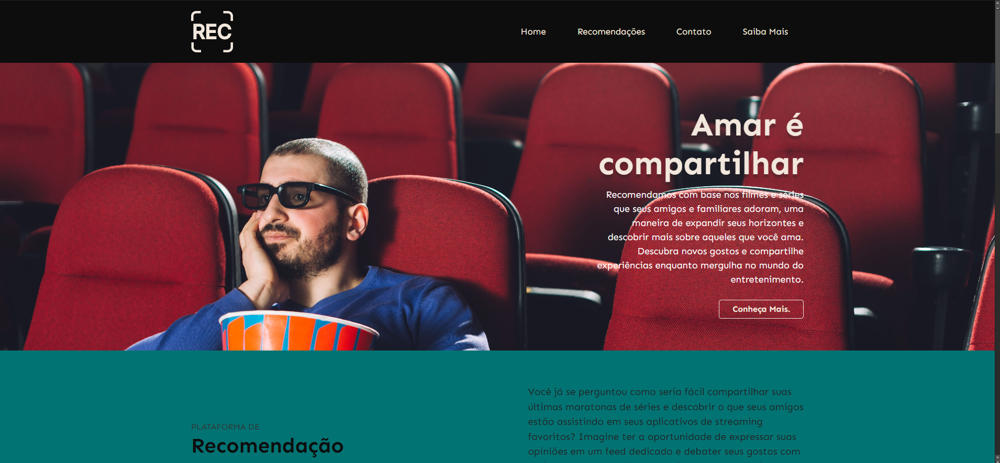

## Wireframes

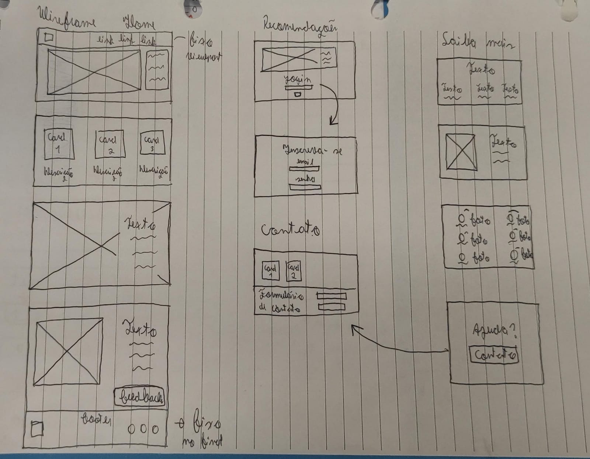

# Metodologia

### Metodologia Adotada

O desenvolvimento do projeto Recomendation seguiu uma metodologia ágil que integrou o Design Thinking e o Framework Scrum. Essa abordagem permitiu uma resposta flexível às mudanças nas necessidades do projeto, ao mesmo tempo em que manteve o foco na satisfação do usuário. Aqui estão os principais aspectos da metodologia adotada:

#### 1. **Design Thinking:**

- O processo de Design Thinking foi implementado para compreender profundamente o problema do "paradoxo da escolha" enfrentado pelos usuários e gerar soluções centradas no usuário. Isso incluiu a criação de personas, entrevistas qualitativas, sessões de brainstorming e priorização de ideias.

#### 2. **Framework Scrum:**

- O Framework Scrum foi utilizado para a gestão do desenvolvimento da aplicação. O projeto foi dividido em iterações chamadas de Sprints, cada uma com um conjunto específico de funcionalidades a serem desenvolvidas. A equipe realizou uma reunião de Planejamento da Sprint, a fim de discutir os requisitos, estimar o esforço necessário e selecionar as tarefas a serem desenvolvidas. Além do acompanhamento diário do progresso e identificação de quaisquer impedimentos.

#### 3. **Divisão de Papéis e Tarefas:**

- A equipe foi dividida de acordo as tarefas específicas de cada sprint.

#### 4. **Ferramentas Empregadas:**

- Para a colaboração e gestão de tarefas, a equipe utilizou o GitHub, aproveitando os recursos do GitHub Projects para criar um quadro Kanban virtual. Isso permitiu a visualização do progresso das tarefas e a priorização das atividades.

## Divisão de Papéis

- Documentação: Amanda;
- Design e prototipação: Pedro, Lucas;
- Slides: Lucas, Rafael;
- Design Thinking: Gustavo.
  
## Ferramentas

| Ambiente  | Plataforma              |Link de Acesso |
|-----------|-------------------------|---------------|
|Processo de Design Thinkgin  | Miro |  <https://miro.com/app/board/uXjVMizTU38=/?share_link_id=9823199308> |
|Repositório de código | GitHub | <https://github.com/ICEI-PUC-Minas-PPLES-TI/plf-es-2023-2-ti1-0387100-recommendationsystem> |
|Protótipo Interativo | Figma | <https://www.figma.com/proto/Xs8Uw7M5RebFcfZ33JACYY/Recommendation-System?type=design&node-id=10-33&t=6ivUU4o5ldyZitOJ-0&scaling=min-zoom&page-id=0%3A1&starting-point-node-id=10%3A33> |
| Quadro Kanban | GitHub Projects | <https://github.com/orgs/ICEI-PUC-Minas-PPLES-TI/projects/249> |
| Editor de Código | Visual Studio Code | <https://code.visualstudio.com/> |
| Comunicação | WhatsApp e Discord| |
| Diagramação | draww.io | <https://www.drawio.com/> |
| Hospedagem | Heroku | <https://www.heroku.com/> |

## Controle de Versão

A configuração do projeto no Git e no GitHub foi realizada de acordo com boas práticas de gerenciamento de versão e colaboração em equipe. Aqui estão os principais pontos relacionados à configuração e gerência no projeto:

**Versionamento Git:**

- O  [Git](https://git-scm.com/) foi escolhido como a ferramenta de controle de versão, permitindo um rastreamento preciso de todas as mudanças no código-fonte.
- O  [Github](https://github.com) foi utilizado para hospedar o repositório, fornecendo uma plataforma centralizada para colaboração.

**Convenção de Nomenclatura de Branches:**

- O projeto segue uma convenção de nomenclatura para as branches, facilitando a identificação do propósito de cada uma:
  - `master`: Branch que contém a versão estável já testada do software.
  - `dev`: Branch que abriga a versão de desenvolvimento do software, onde as funcionalidades são mergeadas após serem implementadas e testadas.
  - Outras branches são associadas a issues específicas documentadas no GitHub Projects, o que ajuda a manter o controle das tarefas e dos objetivos.

**Gerenciamento de Issues:**

- As issues são gerenciadas de forma eficaz no GitHub, com a seguinte convenção de etiquetas:
  - `hotfix`: Correções rápidas e com alta prioridade.
  - `bugfix`: Funcionalidade está com problemas, correção de bugs.
  - `enhancement`: Melhorias em funcionalidades existentes.
  - `feat`: Novas funcionalidades que precisam ser introduzidas.
  - `docs`: Documentação do projeto.
  - Outras etiquetas seguem o padrão de conventional commits, que também é adotado na criação das issues, nos commits e no nome das branches, o que facilita a identificação do tipo de mudança realizada.

**Gestão de Merges, Commits e Pull Requests:**

- Merges são cuidadosamente gerenciados, seguindo um processo de revisão por pares para garantir a qualidade do código antes de ser mesclado na branch de desenvolvimento (`dev`) ou na branch principal (`master`).
- Commits são feitos com mensagens claras e seguindo a convenção de conventional commits, o que simplifica o acompanhamento do histórico de alterações.
- Pull Requests são criados para solicitar a revisão de código por parte dos membros da equipe, garantindo que as mudanças sejam revisadas antes de serem mescladas no repositório principal.

# Projeto da Solução

## Tecnologias Utilizadas

| Ambiente  | Plataforma              |Link de Acesso |
|-----------|-------------------------|---------------|
|Processo de Design Thinkgin  | Miro |  <https://miro.com/app/board/uXjVMizTU38=/?share_link_id=9823199308> |
|Repositório de código | GitHub | <https://github.com/ICEI-PUC-Minas-PPLES-TI/plf-es-2023-2-ti1-0387100-recommendationsystem> |
|Protótipo Interativo | Figma | <https://www.figma.com/proto/Xs8Uw7M5RebFcfZ33JACYY/Recommendation-System?type=design&node-id=10-33&t=6ivUU4o5ldyZitOJ-0&scaling=min-zoom&page-id=0%3A1&starting-point-node-id=10%3A33> |
| Quadro Kanban | GitHub Projects | <https://github.com/orgs/ICEI-PUC-Minas-PPLES-TI/projects/249> |
| Editor de Código | Visual Studio Code | <https://code.visualstudio.com/> |
| Comunicação | WhatsApp e Discord| |
| Hospedagem | Vercel | <https://vercel.com/> |

> Descreva aqui qual(is) tecnologias você vai usar para resolver o seu
> problema, ou seja, implementar a sua solução. Liste todas as
> tecnologias envolvidas, linguagens a serem utilizadas, serviços web,
> frameworks, bibliotecas, IDEs de desenvolvimento, e ferramentas.
> Apresente também uma figura explicando como as tecnologias estão
> relacionadas ou como uma interação do usuário com o sistema vai ser
> conduzida, por onde ela passa até retornar uma resposta ao usuário.
>
> Inclua os diagramas de User Flow, esboços criados pelo grupo
> (stoyboards), além dos protótipos de telas (wireframes). Descreva cada
> item textualmente comentando e complementando o que está apresentado
> nas imagens.

## Arquitetura da solução
A aplicação é composta por páginas web desenvolvidas em HTML, CSS e JavaScript, com armazenamento local implementado por meio do LocalStorage. A hospedagem é realizada na plataforma Vercel, garantindo eficiência no ciclo de vida do desenvolvimento e implantações automáticas.
> 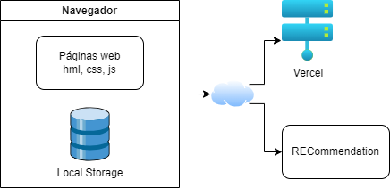

# Avaliação da Aplicação
## Relatório de Testes

#### 1. Página de Inicial:
- **Funcionalidade:** Redirecionamento ao Clicar em "Cadastrar" e "Login"
  - *Cenário de Teste 1:* Clicar em "Cadastrar"
    1. Acesse a página inicial.
    2. Clique no botão "Cadastrar".
    - *Resultado Esperado:* Redirecionamento para a página de cadastro.
  - *Cenário de Teste 2:* Clicar em "Login"
    1. Acesse a página inicial.
    2. Clique no botão "Login".
    - *Resultado Esperado:* Redirecionamento para a página de login.
> 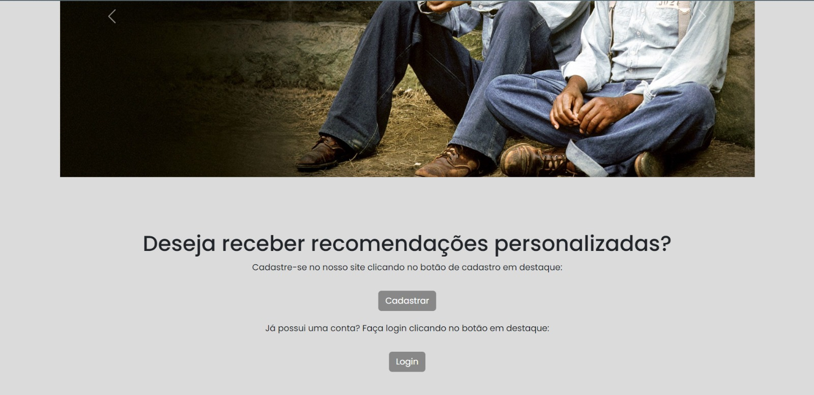

#### 2. Página de Login:
- **Funcionalidade:** Inserção de informações e Redirecionamento
  - *Cenário de Teste 1:* Inserir informações corretas e clicar em "Entrar"
    1. Acesse a página de login.
    2. Insira informações válidas.
    3. Clique no botão "Entrar".
    - *Resultado Esperado:* Redirecionamento para a home do site.
> 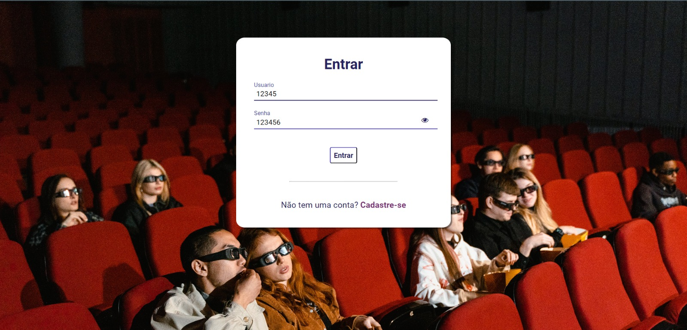

#### 3. Página de Cadastro:
- **Funcionalidade:** Cadastro de Usuário
  - *Cenário de Teste 1:* Preencher informações e cadastrar
    1. Acesse a página de cadastro.
    2. Preencha corretamente os campos.
    3. Clique no botão "Cadastrar".
    - *Resultado Esperado:* Redirecionamento para a página de cadastro de gostos.
> 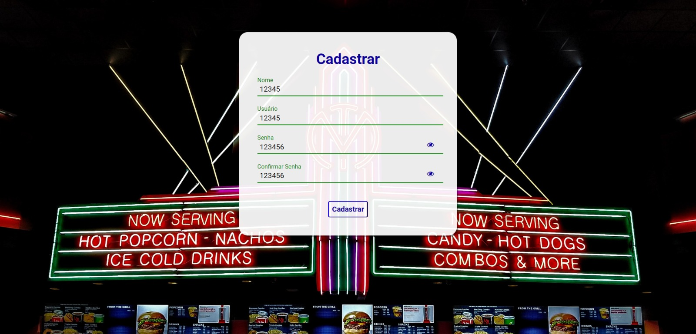

#### 4. Página de Cadastro de Gostos:
- **Funcionalidade:** Seleção de Preferências e Seguir Cadastro
  - *Cenário de Teste 1:* Selecionar gostos e seguir cadastro
    1. Acesse a página de cadastro de gostos.
    2. Selecione preferências da lista.
    3. Clique no botão "Seguir Cadastro".
    - *Resultado Esperado:* Redirecionamento para a página 4.
> 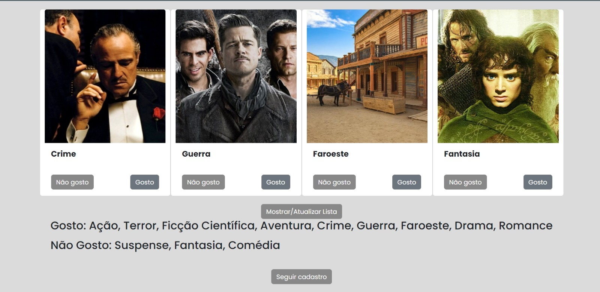

#### 5. Página 4 - Adicionar Filmes ao Histórico:
- **Funcionalidade:** Adicionar Filmes e Finalizar Cadastro
  - *Cenário de Teste 1:* Adicionar informações do filme e finalizar cadastro
    1. Acesse a página 4.
    2. Adicione informações do filme.
    3. Clique no botão "Finalizar Cadastro".
    - *Resultado Esperado:* Redirecionamento para a home.
> 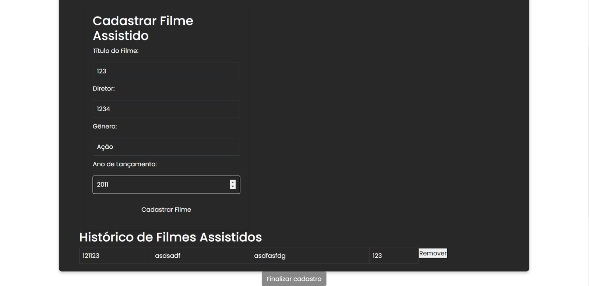

#### 6. Home:
- **Funcionalidade:** Acesso a Recomendações, Perfil, Destaques e Catálogo
  - *Cenário de Teste 1:* Clicar em "Perfil"
    1. Acesse a home.
    2. Clique na opção "Perfil".
    - *Resultado Esperado:* Redirecionamento para a página de perfil.
  - *Cenário de Teste 2:* Clicar em "Catálogo"
    1. Acesse a home.
    2. Clique na opção "recomendações".
    - *Resultado Esperado:* Visualização do catálogo de filmes.
 - *Cenário de Teste 3:* Clicar em "saiba mais"
    1. Acesse a home.
    2. Clique na opção "saiba mais".
    - *Resultado Esperado:* Visualização do footer saiba mais.
> 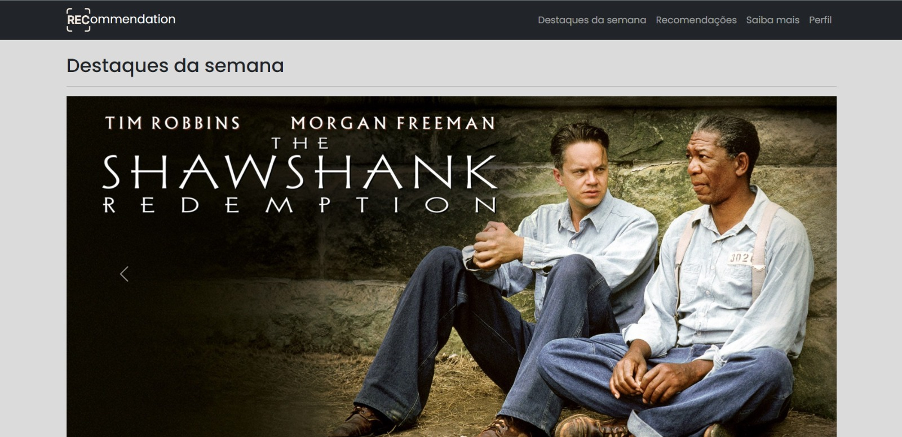

#### 7. Página de Perfil:
- **Funcionalidade:** Atualização de Informações e Navegação
  - *Cenário de Teste 1:* Atualizar informações e voltar para home
    1. Acesse a página de perfil.
    2. Atualize informações.
    3. Clique em "Voltar para Home".
    - *Resultado Esperado:* Redirecionamento para a home.
 - *Cenário de Teste 2:* Atualizar informações
    1. Acesse a página de perfil.
    2. Atualize informações.
    - *Resultado Esperado:* Informações atualizadas.
 - *Cenário de Teste 3:* sair da conta
    1. Acesse a página de perfil.
    2. Clique em Sair.
    - *Resultado Esperado:* voltar para a página inicial.
> 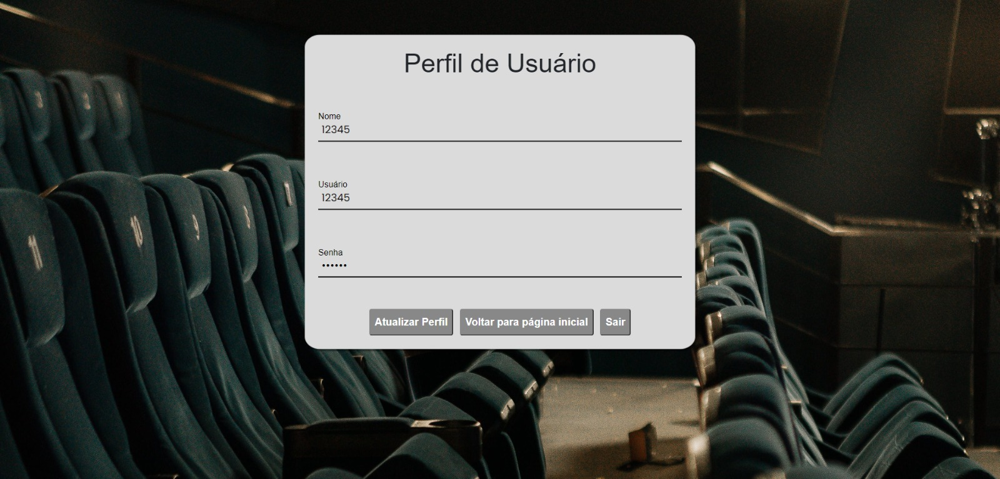

#### 8. Cards na Home:
- **Funcionalidade:** Botões "Saiba Mais" e "Ver Detalhes"
  - *Cenário de Teste 1:* Clicar em "Saiba Mais"
    1. Acesse a home.
    2. Clique no botão "Saiba Mais" de um card.
    - *Resultado Esperado:* Redirecionamento para a página de crítica especializada sobre o filme.
  - *Cenário de Teste 2:* Clicar em "Ver Detalhes"
    1. Acesse a home.
    2. Clique no botão "Ver Detalhes"
 de um card.
    - *Resultado Esperado:* Abertura de um pop-up com informações do filme e compatibilidade com o usuário.
> 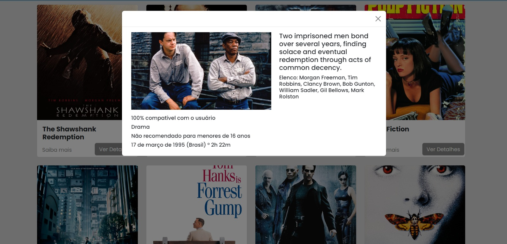

## Registros de Testes

## Resultados do Teste

Todos os cenários foram testados conforme planejado, e os resultados foram consistentes com as expectativas. As funcionalidades de cadastro, login e navegação entre páginas estão operando conforme o esperado.

### Pontos Fortes:
- Redirecionamento adequado após o cadastro e login.
- Acesso consistente às diferentes seções da aplicação.
- Atualização de informações de perfil e saída da conta funcionam conforme o esperado.

### Pontos Fracos Identificados:
- Nenhuma falha significativa foi identificada nos testes realizados.

### Melhorias Planejadas:
- Considerar testes de desempenho para garantir escalabilidade.
- Explorar cenários de teste adicionais para cobrir casos mais complexos.
- Implementar testes automatizados para garantir a robustez contínua do sistema.
- Monitorar feedback do usuário para identificar possíveis melhorias na experiência.

# Referências

#### Design Thinking:
"Design Thinking: Integrating Innovation, Customer Experience, and Brand Value" - Thomas Lockwood.
"Change by Design: How Design Thinking Transforms Organizations and Inspires Innovation" - Tim Brown.

#### Scrum e Metodologias Ágeis:
"Scrum: A Arte de Fazer o Dobro do Trabalho na Metade do Tempo" - Jeff Sutherland.
"Agile Estimating and Planning" - Mike Cohn.

#### Testes de Software:
"Effective Software Test Automation" - Kanglin Li.
"Foundations of Software Testing" - Dorothy Graham, Erik van Veenendaal.

#### Arquitetura de Software:
"Clean Architecture: A Craftsman's Guide to Software Structure and Design" - Robert C. Martin.
"Designing Data-Intensive Applications" - Martin Kleppmann.

#### UX/UI Design:
"Don't Make Me Think, Revisited: A Common Sense Approach to Web Usability" - Steve Krug.
"The Design of Everyday Things" - Don Norman.

#### GitHub e Controle de Versão:
GitHub Docs - documentação oficial do GitHub.

#### Ferramentas de Desenvolvimento Web (HTML, CSS, JavaScript):
MDN Web Docs: MDN Web Docs.
"Eloquent JavaScript" - Marijn Haverbeke.
